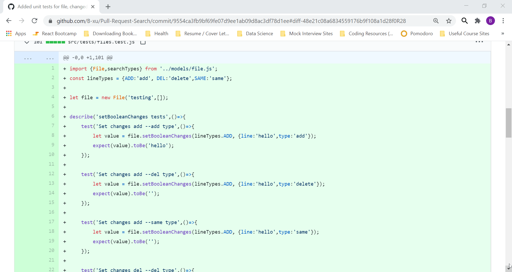

# Diff Search: 
  
Diff Search is a Chrome/Firefox extension that allows you to search multiple lines in a Github commit or pull-request diff. Simply type or copy your search (of more than 1 line) into the search tool and it will highlight the relevant lines on the page. 

Note: if typing text in, separate lines using the Enter key.

## Setup
You can load the extension into your browser through the browser's extension tools page:

- Chrome/Opera:
  1. Type `chrome://extensions` in your address bar to bring up the extensions page.
  2. Enable developer mode (checkbox)
  3. Click the "Load unpacked extension" button, navigate to the `src` folder of your local extension instance, and click "Ok".
- Firefox
  1. Type `about:debugging` in your address bar to bring up the add-ons page.
  2. Click the `Load Temporary Add-on` button, navigate to the `src/manifest.json` file, and "Open".

## Keybindings
| OS                 | Shortcut                 |
| -------------------| ------------------------ |
| Mac                | <kbd>cmd-shift-f</kbd>   |
| Windows/Linux      | <kbd>ctrl-shift-f</kbd>  |

